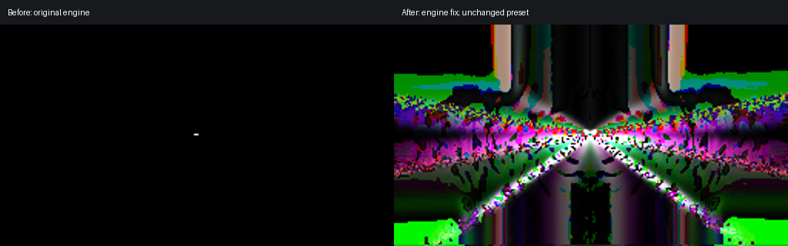

# HLSL remainder regression presets

Load these files in a projectM frontend. They reproduce floating-point `%` being reduced to scalar integer remainder by the HLSL parser/generator. No external image textures are required.

## Minimal case

`float3-remainder.milk` needs no audio. Its composite shader contains:

```hlsl
float3 one = float3(0.75, 0.5, 0.25);
float3 two = float3(0.5, 0.3, 0.2);
ret = one % two * 2;
```

Expected RGB is approximately `(0.5, 0.4, 0.1)`, a uniform amber image. Before the fix, the expression is parsed as `one % (two * 2)` and converted to scalar integer remainder, resulting in black. The fixed AST keeps the float3 result and left-to-right multiplicative precedence; GLSL uses `mod(one, two) * 2`.

## Real preset

`ORB - Burnt Ice --- Isosceles edit.milk` is an unchanged ORB/Isosceles community preset from projectM's Cream of the Crop collection, distributed as public domain by that collection. Its final composite uses `ret = one%two*2`, where both operands are float3 image samples. The affected build shows a tiny white central mark; the fixed build shows coloured, animated geometry.



The screenshots compare frame 210 with identical preset, audio, resolution and seeds. Measured on the patched projectM 4.1.7 integration on Apple M4 Pro / macOS desktop OpenGL 4.1, at 256×144 and 30 fps, using a peak-normalized 44.1 kHz multiband carrier with 80 Hz pulses. A fixed clock and fixed random seeds were used in the diagnostic runner. Mean lit-screen coverage over seconds 4–10 increased from 0.0073% to 55.69%. These are reproduction measurements, not general preset-quality ratings; the upstream code fix is also verified by the CTest regression suite.

Additional affected community presets include `ORB - Burnt Ice`, `suksma - rechivalrizing tents`, `suksma - satanic teleprompter - blus`, and `suksma - chernobyl pie for dessert - macrotopyc uslothpia`. All ten tested presets using the same float3 expression recovered visible output with the engine fix. Other texture warnings on some presets are independent of this change.

`HLSLModuloTest.cpp` covers scalar/vector type promotion, integer and unsigned-vector remainder, multiplicative/bitwise precedence, and generated GLSL for desktop, ES 3.0 and the legacy fallback. Run it with:

```sh
cmake -S . -B build -DBUILD_TESTING=ON -DENABLE_PLAYLIST=OFF -DENABLE_SYSTEM_PROJECTM_EVAL=OFF
cmake --build build
ctest --test-dir build --output-on-failure
```

The minimal preset was written for this regression and is released under CC0-1.0.
