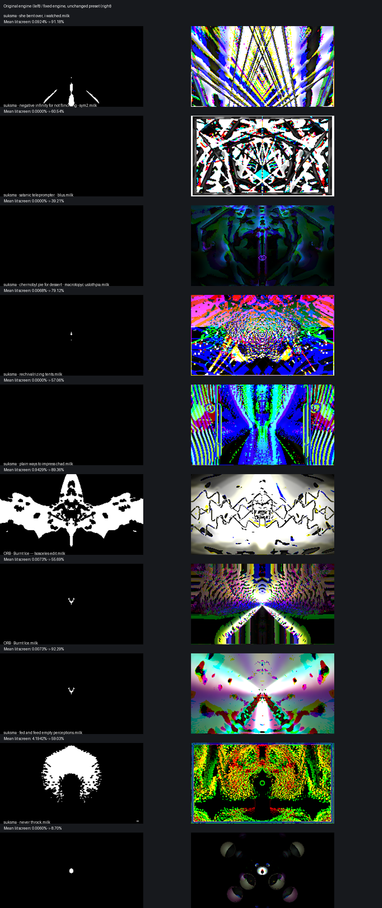

# HLSL remainder: ten confirmed preset comparisons

This branch holds supplementary reproduction material for the floating-point/vector `%` fix. It is separate from the code PR to keep the compiler diff focused.

All ten original presets were rendered unchanged before and after fixing the engine. No source expressions were rewritten to `fmod` for these comparisons. Each uses `one % two` on float3 colours. All 20 runs completed with zero OpenGL error frames.

## Results

Mean lit-screen area over seconds 4–10. A pixel counts as lit when mean RGB exceeds 0.04 of full range. The threshold is an experimental visibility measure, not a universal quality rating.

| Preset (download original) | Before | Fixed engine | Independent texture warning |
|---|---:|---:|---|
| [suksma - she bent over, i watched.milk](presets/suksma%20-%20she%20bent%20over,%20i%20watched.milk) | 0.0924% | 91.18% | No |
| [suksma - negative infinity for not flinching - sym2.milk](presets/suksma%20-%20negative%20infinity%20for%20not%20flinching%20-%20sym2.milk) | 0.0000% | 60.54% | Yes |
| [suksma - satanic teleprompter - blus.milk](presets/suksma%20-%20satanic%20teleprompter%20-%20blus.milk) | 0.0000% | 39.21% | No |
| [suksma - chernobyl pie for dessert - macrotopyc uslothpia.milk](presets/suksma%20-%20chernobyl%20pie%20for%20dessert%20-%20macrotopyc%20uslothpia.milk) | 0.0068% | 79.12% | No |
| [suksma - rechivalrizing tents.milk](presets/suksma%20-%20rechivalrizing%20tents.milk) | 0.0000% | 57.06% | No |
| [suksma - plain ways to impress chad.milk](presets/suksma%20-%20plain%20ways%20to%20impress%20chad.milk) | 0.9429% | 89.36% | No |
| [ORB - Burnt Ice --- Isosceles edit.milk](presets/ORB%20-%20Burnt%20Ice%20---%20Isosceles%20edit.milk) | 0.0073% | 55.69% | No |
| [ORB - Burnt Ice.milk](presets/ORB%20-%20Burnt%20Ice.milk) | 0.0073% | 92.29% | No |
| [suksma - fed and feed empty perceptions.milk](presets/suksma%20-%20fed%20and%20feed%20empty%20perceptions.milk) | 4.1942% | 59.03% | No |
| [suksma - never throck.milk](presets/suksma%20-%20never%20throck.milk) | 0.0060% | 8.70% | Yes |

The contact sheet uses the peak-brightness snapshot from each run; those peak frames may differ. The primary PR includes a separate same-frame Burnt Ice comparison.

## Reproduction

Download `hlsl-modulo-comparisons.zip` or individual files under `presets/`. Load a preset in a projectM frontend on the unpatched and patched engine, with bass-heavy music playing. The tiny/black output is most apparent in the two Burnt Ice presets, satanic teleprompter, rechivalrizing tents, and chernobyl pie. Texture warnings on negative infinity and never throck are independent of the modulo issue; restoring colours does not establish full rendering correctness for those cases.

A texture-free, audio-free minimal preset is also included in the code branch under `presets/tests/hlsl-modulo/float3-remainder.milk`: expected RGB `(0.5, 0.4, 0.1)`; original output is black. This provides a quick deterministic check of the same three defects without judging a music preset by appearance.

## Measurement conditions

Apple M4 Pro; desktop OpenGL 4.1; patched projectM 4.1.7 integration; 256×144; 30 fps; 10 seconds per run; first 4 seconds excluded. Audio: common multiband carrier plus 80 Hz pulses, peak-normalized per frame-sized capture buffer at 44100 Hz. Clock, initial hue, noise textures and random selections were seeded consistently. Evaluator state starts in a fresh process. Same preset assets, audio and settings were used before and after. The engine changes match the upstream compiler patch.

The upstream master build is separately covered by the full CTest suite (157 tests), including ten new modulo regressions; the pinned integration suite has 107 passing tests. Six mixed scalar/vector/int/uint GPU cases and positive/negative same-sign float vectors match expected pixel colours within one 8-bit quantization step.

`comparisons.json` and `comparisons.csv` contain measurements, texture-warning flags, and SHA-256 fingerprints of each preset. The preset collection is distributed as public domain by projectM's Cream of the Crop collection; attribution is retained in file names. Images are generated test captures.

Three linked issues are addressed: the parser forced modulo result type to scalar int; the generator forced operand casts to scalar int; and the priority table omitted the modulo slot. The last defect also shifted later comparison/bitwise precedence entries.

There are additional source-scan candidates (44 suspected floating-point cases in a 9606-preset collection), but only the ten cases above have been validated by paired renders. Do not treat a shader's use of `%` as proof of a failure; integer-counter remainder is legitimate.
