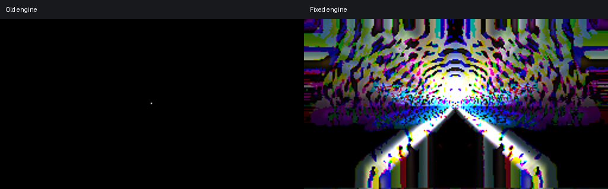
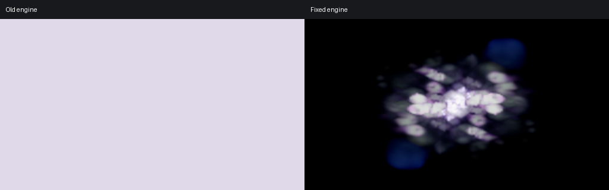
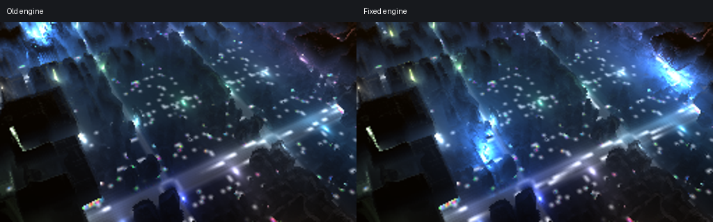

# Real music, real presets: Rainy Melody comparisons

Music: **1926 – Rainy Melody (Original Mix)**, FLAC supplied for testing, excerpt **1:00–1:20**. Both engines receive the same peak-normalized 44.1 kHz audio blocks with matched frame clock, seeds, preset and texture assets. Public video clips are muted; audio playback is retained in the local test videos. The recording itself is not included.

These are unchanged community music presets, not synthetic shaders. Captures run at 256×144, 30 fps for 20 seconds; aggregate metrics exclude the first four seconds.

## Burnt Ice: floating-point/vector remainder

`ORB - Burnt Ice --- Isosceles edit.milk` uses `ret = one%two*2` on float3 colour samples. Original output is a tiny white central mark; patched output is a coloured scene. Average lit coverage changes from **0.00965% to 54.88%** with this actual music excerpt.



[View the matched-time video](00-comparison-muted.mp4).

## Elusive Impressions: precedence and result type

`martin - elusive impressions mix2.milk` contains:

```hlsl
uv *= 1-q28%2/4;
```

The original generated GLSL groups this as `(1-q28) % (2/4)`, with integer remainder and integer division; `2/4` is zero. The resulting picture is largely a flat pale field. The corrected shader uses `1 - mod(q28, 2.0) / 4.0` and restores the detailed image.



[View the matched-time video](04-comparison-muted.mp4).

A staged engine experiment separates the defects while keeping this real preset and track unchanged:

| Engine stage | Relevant GLSL | Mean RGB difference from full fix |
|---|---|---:|
| Original | `(int(1-q28) % (2/4))` | 17.48% |
| Only precedence corrected | `1 - ((int(q28) % 2) / 4)` | 2.07% |
| Precedence and result type corrected; integer operand casts still present | `1.0 - ((int(q28) % 2) / 4.0)` | **0.00% (byte-identical)** |
| Full fix | `1.0 - mod(q28, 2.0) / 4.0` | reference |

Here q28 is an integer-valued beat counter stored as float. This lets the old operand cast remain numerically harmless in the staged result-type test, while exposing incorrect integer division of the remainder. This is direct real-preset evidence for the result-type defect in addition to the precedence defect.

## City Lights: integer remainder precedence

`martin - city lights.milk` contains expressions such as:

```hlsl
(int(uv3.x*64)%8-4)*-0.024*time
```

Original GLSL uses `int(...) % (8-4)`; corrected GLSL uses `(int(...) % 8) - 4`, fixing the intended scrolling offset. The visual difference is subtle in this excerpt: about 1.39% of pixels exceed the 0.05 difference threshold, averaged across frames. This is not a black-preset failure and should not be presented as one.



[View the matched-time video](01-comparison-muted.mp4).

## Evidence boundaries

Logs, generated shaders, metrics and staged-build measurements are included alongside the presets. Shader files include the initialization/default shader as well as the preset shader; use files containing the quoted expressions above when reviewing the translation. Measurements are from the pinned projectM 4.1.7 Android TV integration on macOS; the upstream master fix also passes its full 157-test CTest suite.

Two other real presets were tested with the same excerpt and were unchanged: `Blendin to myself AdamFX Twist 2 martin - glassball dance with Cope` and `martin - pixies party filth edition`. They are recorded in the complete measurement file as negative results and are not cited as confirmed visual failures. Source-pattern matches alone do not establish an active rendering defect.

The wider ten-preset comparison uses controlled audio and confirms the float3 Burnt Ice family. These three cases add real music and a different preset exhibiting precedence/result-type defects. Comparison/bitwise precedence beyond these specific expressions is covered by parser unit tests; no separate real-preset claim is made for those operators.
